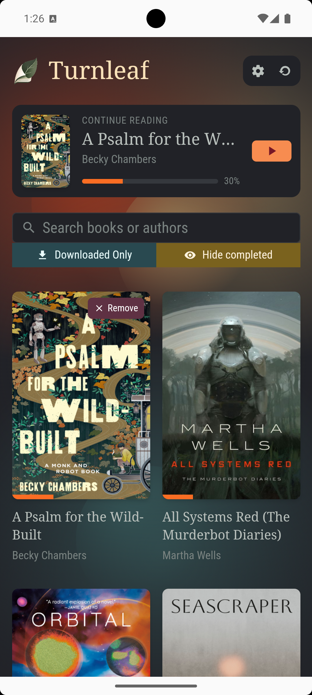
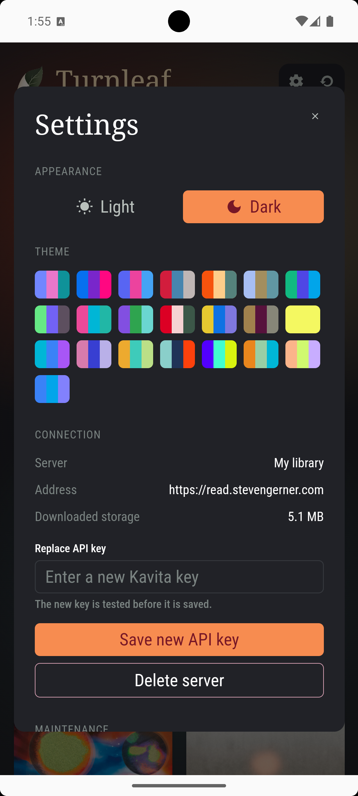
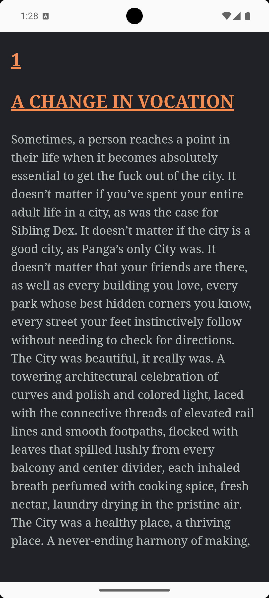
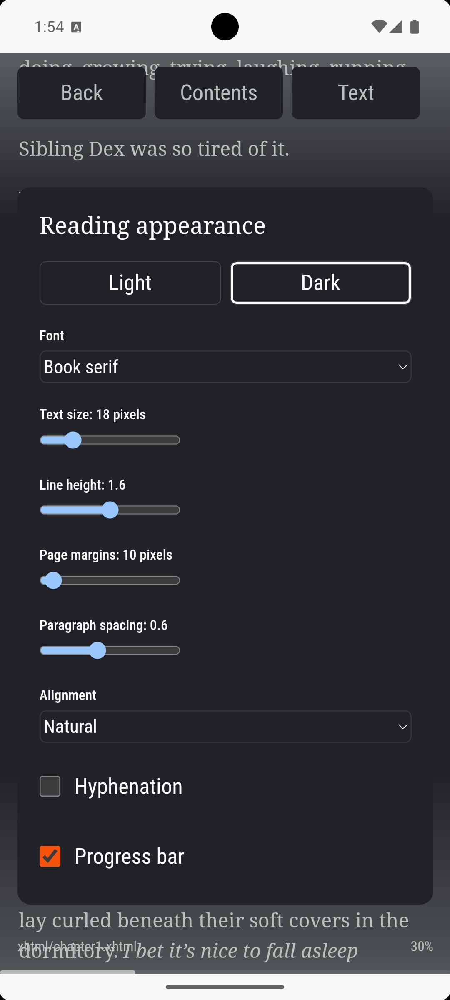
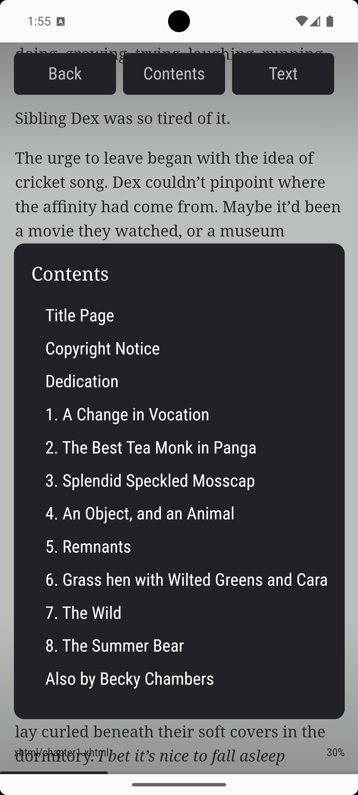

# Turnleaf

Turnleaf is an offline-first, mobile EPUB reader for Kavita. It is a local app only: there is no companion server, no proxy, and no hidden backend.

The goal is simple: connect to Kavita, download books, read them as paginated pages, and keep progress synchronized across devices without making reading feel like a web app.

## Screenshots

### Library



### Global Settings



### Reader



### Reader Settings



### Contents



## Why this exists

I built Turnleaf because the existing options I tried did not fit the use case I wanted:

- Kavita's PWA scrolls books instead of rendering proper pages, and it does not provide offline access.
- Inkita also scrolls books.
- Inkavi is missing an ePub dependency.
- KOReader was difficult to get working reliably for cross-device sync.
- Kover renders books as one continuous block of text without the indentation and paragraph spacing I wanted.

Turnleaf is the small, direct answer to those problems.

## What Turnleaf does

- Connects directly to a Kavita server with the Kavita REST API.
- Browses only book-oriented library content.
- Downloads EPUBs into app-private storage for offline reading.
- Opens downloaded EPUBs instantly and reads them as paginated pages.
- Turns pages with left and right taps.
- Shows reader controls with a center tap.
- Synchronizes reading progress back to Kavita.
- Restores the correct semantic EPUB location after reopening.
- Lets you tune the reading experience with font, size, margin, line-height, and theme controls.
- Supports light and dark modes plus a theme selector.
- Keeps credentials in native secure storage instead of localStorage.
- Stores durable app data in SQLite.

## Supported content

Turnleaf is intentionally narrow in scope.

Supported:

- EPUB books
- Text-first novels and long-form prose

Not supported:

- Manga
- Comics
- PDFs
- Audiobooks
- Magazines
- Image-based readers

That limitation is deliberate. Turnleaf is optimized for conventional book reading, not for every media type Kavita can host.

## Tech stack

Turnleaf is built with:

- Svelte 5
- TypeScript with strict type checking
- Vite
- Capacitor
- Skeleton UI
- Tailwind CSS
- EPUB.js for EPUB rendering
- SQLite for local structured data
- `@capacitor-community/sqlite` for durable app storage
- `@aparajita/capacitor-secure-storage` for Keychain / Keystore-backed credentials
- Capacitor Filesystem and File Transfer for native EPUB downloads
- DOMPurify for sanitizing Kavita-provided HTML

## Architecture

The app stays intentionally boring inside:

- Svelte components own the UI.
- Small domain modules handle Kavita, storage, downloads, sync, and reader state.
- SQLite stores server configuration, book metadata, reading state, and sync queue entries.
- Secure storage stores the credential reference and the actual secret.
- Downloaded EPUBs live in app-private native storage.
- Reader rendering is isolated inside a sandboxed EPUB.js iframe.

There is no repository layer, service locator, event bus, or backend abstraction for its own sake.

## Current limitations

- Only EPUB is supported.
- I do not have a Mac, so iOS has only been scaffolded and synchronized as far as Linux allows.
- Android is the only platform I have personally tested end-to-end.
- The browser dev server is useful for UI work, but native secure storage and native EPUB file handling are still Capacitor features.

Because the app is a Capacitor wrapper around a Svelte application, it should build on macOS for iOS once Xcode is available, but that has not been verified from this machine.

## Getting started

### Prerequisites

- Node.js
- npm
- For Android: Java 21, Android Studio, Android SDK, and an emulator or device
- For iOS on macOS: Xcode and CocoaPods

### Install

```bash
npm ci
```

### Run the web app

```bash
npm run dev
```

Use this for fast UI iteration and browser-based testing of the Svelte app. Native storage, downloads, and secure credential storage require Capacitor builds.

### Quality checks

```bash
npm run format
npm run format:check
npm run lint
npm run check
npm test
npm run build
```

## Android setup

Turnleaf has been tested on Android. The repo includes the Capacitor Android project and release/debug build scripts.

```bash
export ANDROID_HOME="$HOME/Android/Sdk"
export PATH="$ANDROID_HOME/platform-tools:$ANDROID_HOME/cmdline-tools/latest/bin:$PATH"
npm run cap:sync
npm run android:debug
```

Useful follow-up commands:

```bash
npm run android:open
npm run android:release
```

If you want to run from Android Studio, open the generated Android project after `cap sync` and use the usual emulator or device workflow.

## iOS setup on macOS

The iOS Capacitor project exists and can be synchronized on Linux, but I have not built or tested it because I do not have a Mac.

On macOS:

```bash
xcode-select --install
brew install node cocoapods
npm ci
npm run build
npm run ios:sync
npm run ios:open
```

Then in Xcode:

1. Open the generated app project.
2. Select the `App` target.
3. Set the development team and signing identity.
4. Confirm the bundle identifier is correct.
5. Build and run on a simulator or device.

If you are trying iOS, please report back what works and what does not.

## Contributing

Contributions and forks are welcome.

Please keep changes small and direct:

- Prefer the simplest implementation that solves the problem.
- Avoid adding abstractions unless they earn their keep.
- Keep EPUB reading, Kavita integration, and local storage behavior explicit.
- Preserve offline-first behavior.
- Do not add new dependencies unless they are clearly necessary.

Before opening a pull request, run:

```bash
npm run format
npm run check
npm run lint
npm test
npm run build
```

If your change touches native behavior, also run the relevant Capacitor or Android build command.

Screenshots for UI changes are appreciated, especially for reader, settings, and library work.

## License

Turnleaf is released under the [MIT License](LICENSE).
